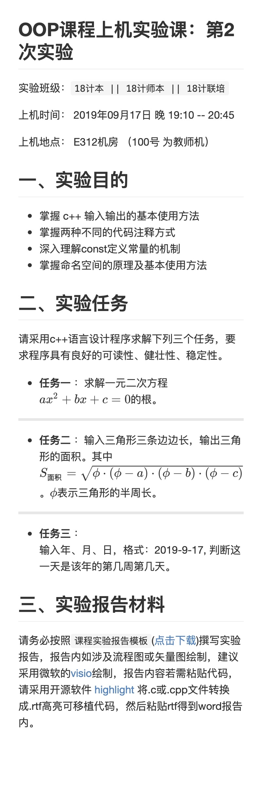

**OOP课程上机实验课：第2次实验**
---

实验班级：`18计本 || 18计师本 || 18计联培`

上机时间： 2019年09月17日 晚 19:10 -- 20:45

上机地点：  E312机房 （100号 为教师机）

## 一、实验目的
*  掌握 c++ 输入输出的基本使用方法
*  掌握两种不同的代码注释方式
*  深入理解const定义常量的机制
*  掌握命名空间的原理及基本使用方法

## 二、实验任务

请采用c++语言设计程序实现下列三个任务，要求程序具有良好的可读性、健壮性、稳定性。

* **任务一** ：求解一元二次方程$ax^2+bx+c=0$的根。

* **任务二** ：输入三角形三条边边长，输出三角形的面积。其中$ S_{面积} = \sqrt{\phi\cdot(\phi-a)\cdot(\phi-b)\cdot(\phi-c)}$。$\phi$表示三角形的半周长。

* **任务三** ：  
  输入年、月、日，格式：2019-9-17,   判断这一天是该年的第几天（编号 1,2,...,365）、第几周(1,2,...52)。
  

## 三、实验报告材料

请务必按照`课程实验报告模板`([点击下载](https://github.com/tsingke/OOP_Homework/raw/master/%E3%80%8A%E9%9D%A2%E5%90%91%E5%AF%B9%E8%B1%A1%E7%A8%8B%E5%BA%8F%E8%AE%BE%E8%AE%A1%E3%80%8B%E5%AE%9E%E9%AA%8C%E6%8A%A5%E5%91%8A%E6%A8%A1%E6%9D%BF.docx))撰写实验报告，报告内如涉及流程图或矢量图绘制，建议采用微软的[visio](https://pan.baidu.com/s/1L4y1pWXcJjojZlIAQZjPAg)绘制，报告内容若需粘贴代码，请采用开源软件 [highlight](http://www.andre-simon.de/zip/highlight-setup-3.53-x64.exe) 将.c或.cpp文件转换成.rtf高亮可移植代码，然后粘贴rtf得到word报告内。报告统一提交到云班课（提交pdf版本）。

---

由于github 不支持`latex`命令，因此上面的公式代码未能正确显示，可以参考这里：

